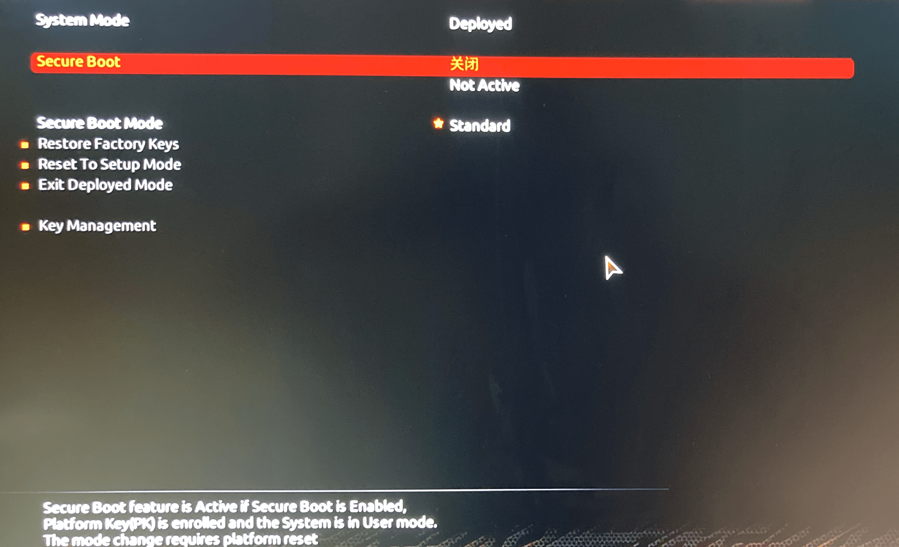
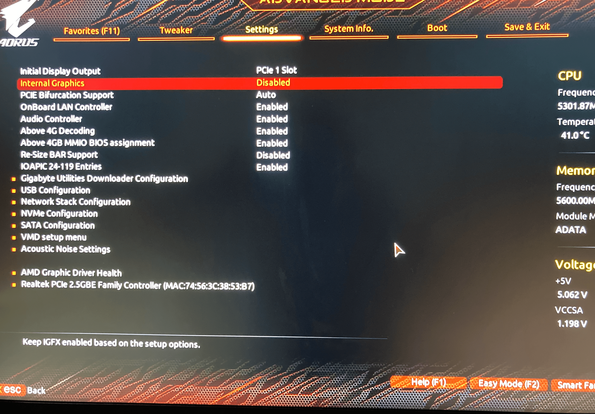
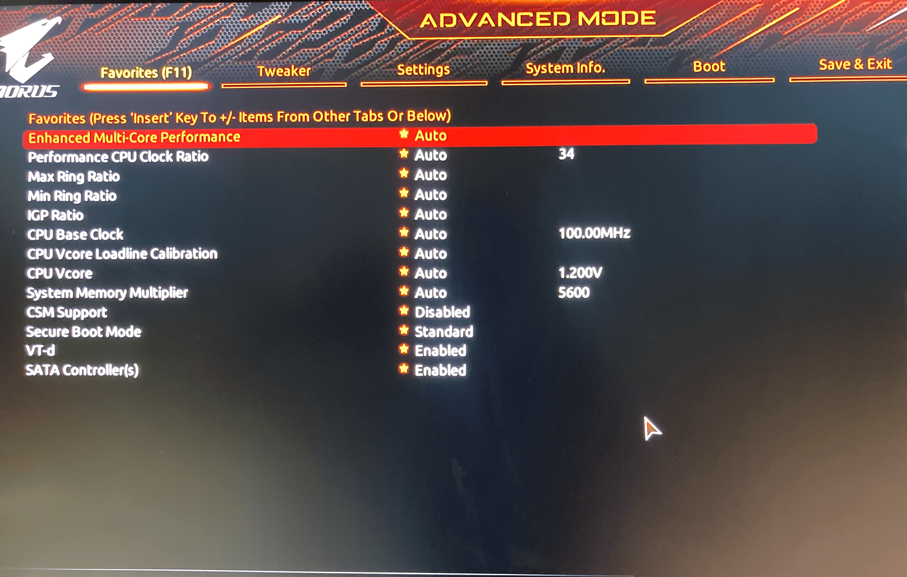

# Gigabyte-Z790-Aorus-Elite-AX-13700K-OpenCore-Hackintosh

- Motherboard :Gigabyte Z790 Aorus Elite ax DDR5
- CPU : I7 13700K
- GPU : Gigabyte RX6600 EAGLE 8G
- OpenCore : 0.8.9
- MacOS : Ventura 13.2.1

# 关于安装

之前是下载完整的MacOS镜像，再使用[etcher](https://github.com/balena-io/etcher)刷入U盘，之后把EFI放入U盘的EFI分区中，这样启动时总是找不到MacOS的选项。

制作U盘启动盘我是用官方建议的方式：[making-the-installer](https://dortania.github.io/OpenCore-Install-Guide/installer-guide/windows-install.html#making-the-installer)

# 关于EFI

EFI会长期更新，但目前很很不完善，不是必须还不建议用。

机型改为iMac pro1,1可以提高单核性能

# 关于BIOS

- **Secure Boot : Disabled**

- Internal Graphics : Disabled

- **Above 4G Decoding : Enabled**

- **Above 4GB MMIO BIOS assignment : Enabled**

- Re-Size BAR Support : Disabled

- **Hyper-Threading : Enabled**

- **CFG Lock : Disabled**

---

推荐的软件

- [MonitorControl](https://github.com/MonitorControl/MonitorControl) ：用来调整屏幕亮度。

目前推荐[nakquada](https://github.com/nakquada/Z790-Hackintosh)的EFI，他的EFI好像跑分比较正常。
